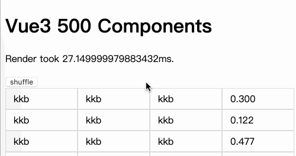
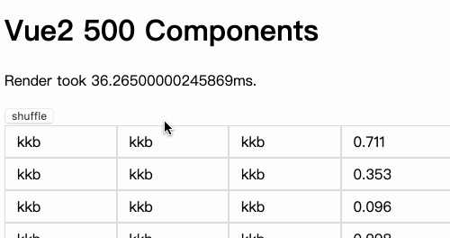
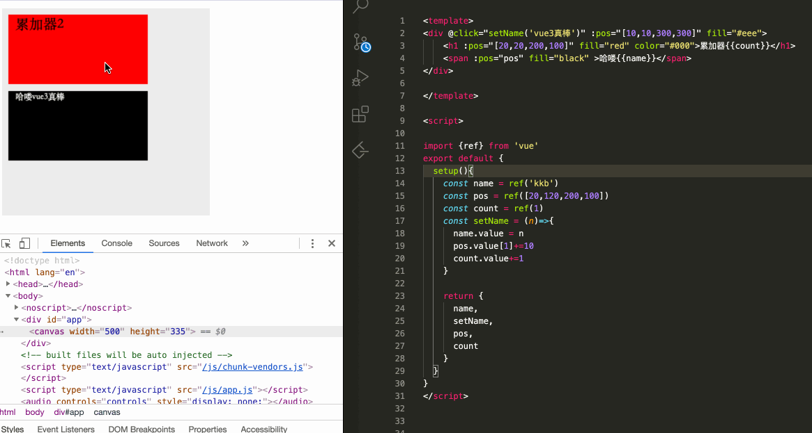
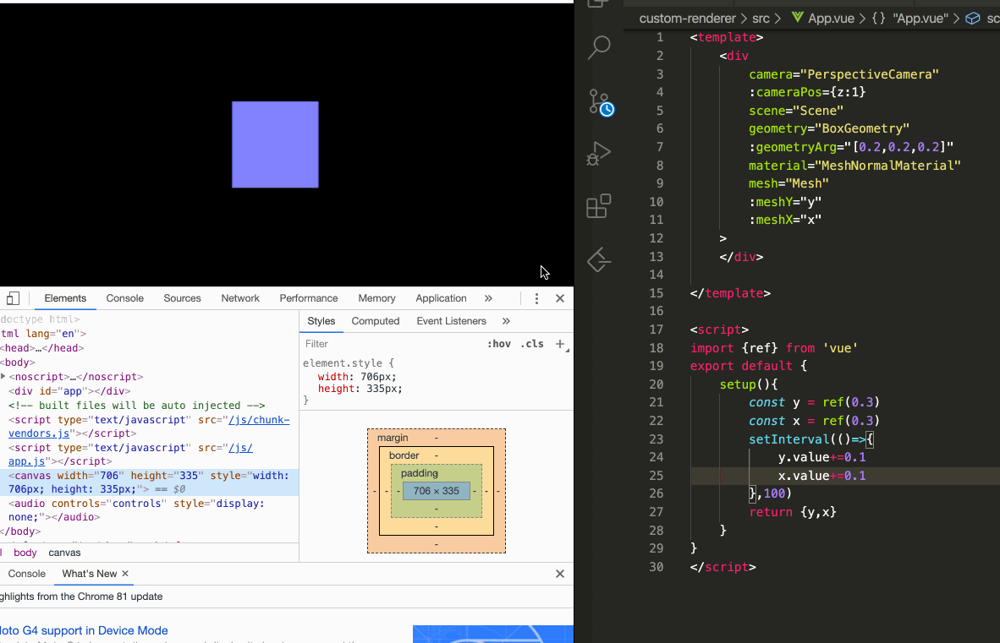
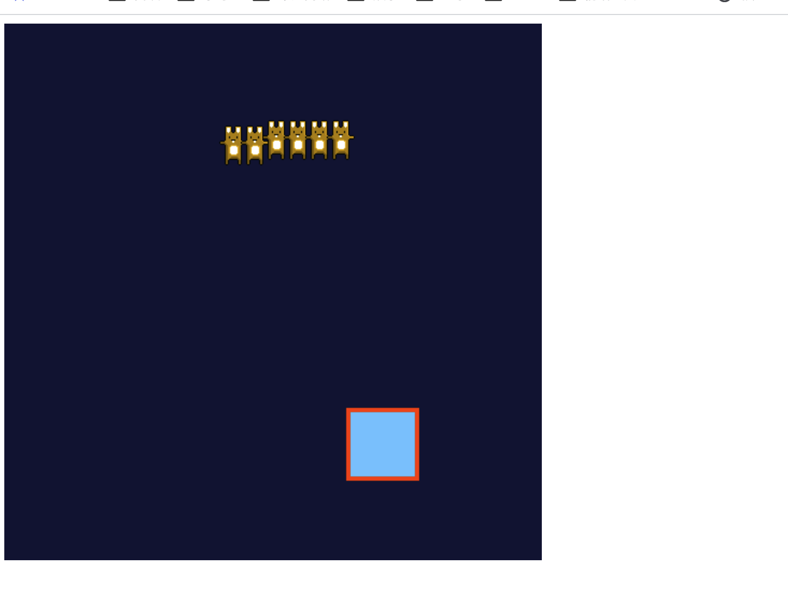

# vue3-vs-vue2
Vue3和Vue2细致比较

@todo  mvc样式   


## 环境

三种体验vue3的方式

1. vue-cli
   * Vue create vue3-demo-cli
   * Vue add vue-next
   * 代码文件 vue3-demo-cli
2. webpack
   1. 代码文件 vue-demo-webpack
   2. [代码仓库](https://github.com/vuejs/vue-next-webpack-preview)
3. 新工具vite
   1. create-vite-app 
   2. 代码文件 vue3-demo-vite


## Reactivity  & Fragment

 Winter奇思妙想   [代码](reactivity)

```
├── Fragment.vue
├── HTTPRequest.js    数据源响应式
├── HTTPRequest.vue 
├── List.vue
├── LocalStorage.js   利用响应式，无缝切换localstorage
├── LocalStorage.vue
├── Three.vue
├── ThreeRender.js
├── TimeLine.js
├── Timer.js          
├── assets
│   └── logo.png
├── main.js
└── vanilla-main.js   原生js双向绑定
```


## SSR

测试vue2和vue3再ssr的环境的表现,使用wrk压测，测试组件 静态动态三比一

```javascript
{
    template: `<div>
    <div v-for="n in 1000">
    <ul >
      <li>kkb</li>
      <li>kkb</li>
      <li>kkb</li>
      <li>kkb</li>
      <li>kkb</li>
      <li>kkb</li>
      <li v-for="todo in todos" >{{n}}--{{todo}}</li>
    </ul>
    </div>
    </div>`,
    data(){
      return {
        todos:['吃饭','睡觉']
      }
    }
  }

```
再vue-comp里执行npm link 然后ssr2和ssr3里npm install共享 

```bash
// vue2 12个进程，300个并发，压19秒
➜  ~ wrk -t12 -c400 -d10s http://localhost:9092/
Running 10s test @ http://localhost:9092/
  12 threads and 400 connections
^[[A  Thread Stats   Avg      Stdev     Max   +/- Stdev
    Latency     1.48s   442.21ms   1.80s    89.88%
    Req/Sec    24.62     20.56    88.00     59.73%
  1319 requests in 10.10s, 173.65MB read
  Socket errors: connect 157, read 183, write 0, timeout 74
Requests/sec:    130.58
Transfer/sec:     17.19MB
```
```bash
// vue3 12个进程，300个并发，压19秒
➜  ~ wrk -t12 -c400 -d10s http://localhost:9093/
Running 10s test @ http://localhost:9093/
  12 threads and 400 connections
  Thread Stats   Avg      Stdev     Max   +/- Stdev
    Latency   770.76ms  165.36ms   1.89s    89.11%
    Req/Sec    63.99     56.81   252.00     74.34%
  2912 requests in 10.10s, 411.12MB read
  Socket errors: connect 157, read 31, write 0, timeout 0
Requests/sec:    288.21
Transfer/sec:     40.69MB
```
QPS大概是有2.2倍的提升 真赞


## update 对比

```bash
vue2-demo
vue3-demo-cli
```
[测试组件代码 ](vue-demo/src/App.vue)      500个组件，静态动态三比一

Vue2 render和update   大概50%  稍微有点波动





## composition vs option 

[官网的对比代码](com)

todo mvc 对比  

@todo 需要加点样式 

@todo 把storage和http的响应式，放在todomvc里


## 自定义renderer

[canvas和three.js](custom-renderer)

[pixi renderer打飞机demo](vue3-runtime-canvas)

```javascript
import { createApp } from './three-renderer';
import App from "./App.vue";

// canvas
// import { createApp } from './renderer';
// import App from "./App1.vue";
createApp(App).mount("#app")
```








第二节课

性能对比
- vue3因为有静态节点标记，所有静态节点标记越多，他的性能越好；
- ssr 对比，vue3 对比vue2, 都有预编译处理；


compiler

- vue2的设计其实比较好了， 但是一些写法上也是笔记到蛋疼， 如果是比较长的组件里， 在option Api中，写一个东西，比较分散，要上下反复横跳，不停的切换；俗话说的，蛇形走位；在data里写了，methods，computed里都需要不停的添加相关的方法，笔试很优雅；
如果要维护一些公共的逻辑，你就需要minix的方式注入进来，在一些方法里，你就很诡异，不知道this.xxx 方法到时是哪里的；如果有多个minix，可能命名还有冲突，比较麻烦；

- 所以vue3中的composition api就是为了解决这个问题的；所有的逻辑都可以封装在类似有useHooks 的方法中引入就可以；useHooks可以单独的维护；而且每一个数据来源都是清晰的；

- compositon api只是长得和react hooks一样；useFunction() 的形式；实际上的原理是天差地别，没有任何关系； React Hooks其实每次都是创建一个闭包； Vue里是响应式；每次只执行一次；仅仅是api上长的比较像，就像雷锋和雷锋塔的关系；

compiler, runtime, reactivity  三大核心模块；


- compiler目的只有一个，我们写的template 实际上是js，返回vdom

- **追本溯源，为什么vue/react需要编译？**

  1.倔强⻘铜
    - jquery dom查找修改 没啥模板的概念
    - `$(xx).html(yy)`

  2.秩序白银
    - Underscore bdtemplate ejs 字符串模板
    - <%= 标记变量
    - <% 标记js语法

    特点：
    - 有数据变化，全量重新渲染即可
    - 原理就是基本的字符串编译，拼接成js函数，然后 `new Function`即可
  3. 荣耀黄金 （vdom时代）
    - 每次重新render成本太高 
    - dom是万恶之源 
    - 按需更新

  为啥操作dom的成本高是吧？一个简单的div的属性很多，基本有200+个属性，要一一对比，确实很累；其实我们大部分节点都是简单的属性；只需简单的数据结构就能标识出来；

  精细化分析
  - 使用js对象描述标签
  - 数据修改，不再全量覆盖，而是js先进行一次 dom diff，然后算出需要修改最小的部分
  - 相当于在template和浏览器之间，加了一层vdom缓存

  问题
  - 用createElement创建元素 写起来太痛苦了，所以`template=> vdom`机制，应运而生
  - https://template-explorer.vuejs.org/
  - Vue2解析结果

  小程序的setData的diff，其实不是很好，所以有很多第三方uniapp这些做了这一层之后性能比原生的更快了；

  编译
  - 写的依然是html ，实际执行的是javascript
  - template=> render函数，经典编译原理
  - ast=> transform=>generate


  前端编译原理 发展还是很快的
  比较好的一个mini-编译原理的git： https://github.com/YongzeYao/the-super-tiny-compiler-CN


具体分析 vue3的compiler
- compiler-core
- compiler-dom

  https://vue-next-template-explorer.netlify.app/


静态标记 

ssr对比 

自定义renderer

```html
<div>
    <h1>哈哈</h1>
    <p>测试一下</p>
    <button @click="shuffle">test</button>
</div>
```
vue2的编译：https://template-explorer.vuejs.org/

vue3的编译：https://vue-next-template-explorer.netlify.app/

vue3中有_openBlock  是一个比较重要的概念，而且都是import进来的，对tree-shaking很有帮助；

